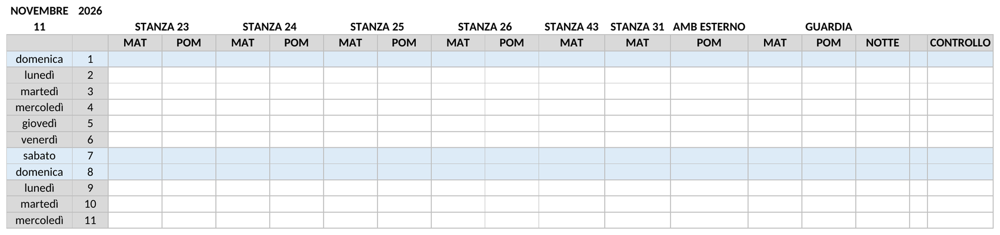
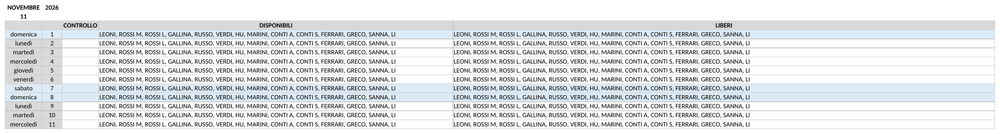
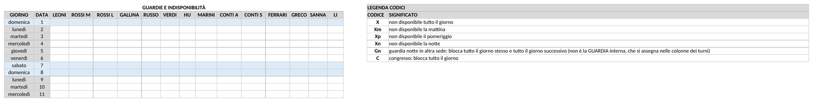
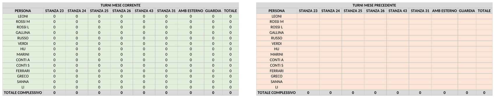
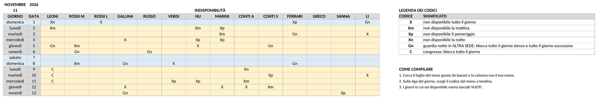
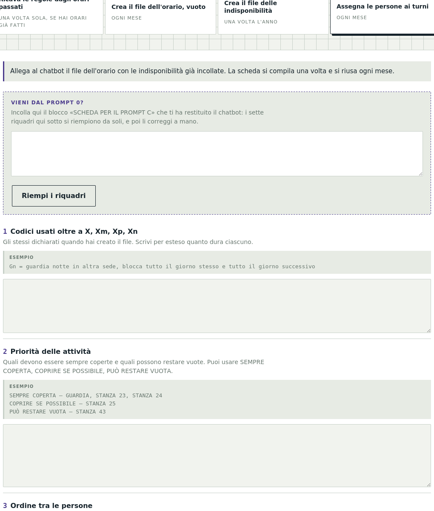
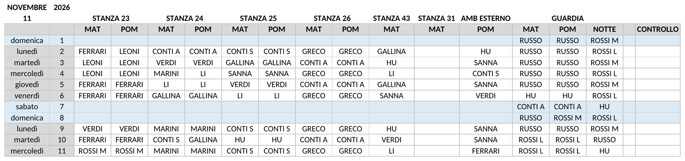
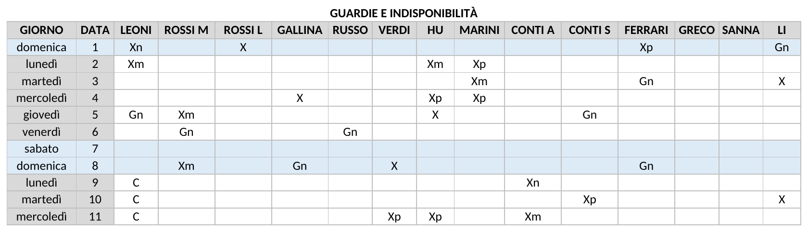
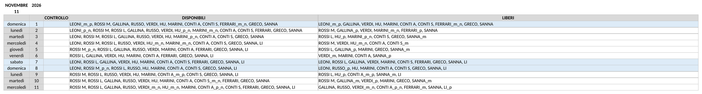
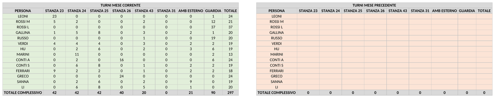

# Turni con l'AI

> **[Apri la pagina per compilare le schede](https://giacomo-ingallina.github.io/turni-ai/)** — le stesse istruzioni che
> leggi qui, con i riquadri da riempire e il tasto che genera il testo da
> incollare nel chatbot.

## Indice

- [Come fare](#come-fare) — i quattro passaggi, con i riquadri da compilare
- [Esempio](#esempio) — un reparto finto, dalle schede al file finito
- [Privacy](#privacy) — come evitare di caricare i nomi veri
- [Domande frequenti](#domande-frequenti)
- [Script e prompt utilizzati](#script-e-prompt-utilizzati)

---

## Introduzione

I chatbot come Claude, ChatGPT e Gemini, anche nelle versioni gratuite, possono essere
utilizzati per organizzare e assegnare i turni di un orario per i più vari tipi di attività:
un reparto ospedaliero con ambulatori, un centro sportivo, una scuola, un negozio, o anche
una suddivisione di nonni e babysitter nella gestione dei nipoti.

Scrivere in modo efficace le istruzioni per il chatbot, chiamate **prompt**, può essere
lungo e complicato.

Questa pagina è pensata per facilitare questo processo: è sufficiente inserire a parole poche
caratteristiche dell'orario desiderato — nomi del personale, indisponibilità, attività da
assegnare e regole da seguire nella compilazione dei turni — per creare comandi pronti da
copiare nei chatbot e ottenere l'orario con i turni compilati secondo l'organizzazione, le
regole e le indisponibilità indicate.

Se ti servissero caratteristiche non previste da queste istruzioni, potrai aggiungerle
dialogando con il chatbot una volta creato l'orario, oppure inserire manualmente i turni non
prevedibili sull'Excel creato.

## Come fare

<table>
<tr>
<td width="25%"></td>
<td width="25%"></td>
<td width="25%"></td>
<td width="25%"></td>
</tr>
<tr>
<td>Scegli tra i quattro riquadri qui sotto la funzione che ti serve</td>
<td>Compila i campi per personalizzare l'orario</td>
<td>Premi il tasto rosso: il comando è pronto e già copiato</td>
<td>Apri il tuo chatbot — Claude, ChatGPT o Gemini — incolla il comando e scarica il file con l'orario</td>
</tr>
</table>

### 1. Crea il file Excel con i turni vuoti

Rispondi alle quattro domande, premi il tasto «Genera il comando pronto da incollare» e
incolla il testo in una chat nuova del chatbot che userai — Claude, ChatGPT o Gemini:
otterrai il file Excel dell'orario del mese, vuoto e pronto da compilare. Le domande sono
queste:

1. mese e anno del file;
2. le attività da coprire: per ognuna il nome (ambulatorio 23), quanti turni al giorno
   (2 turni) e come si chiamano (MAT e POM);
3. i nomi delle persone che coprono i turni;
4. i codici di indisponibilità che usi oltre a quelli di base (`X` = non disponibile tutto
   il giorno, più uno per ogni parte della giornata: `Xm` la mattina, `Xp` il pomeriggio,
   `Xn` la notte).

**Come chiami i turni conta**, perché da lì discendono le regole, senza che tu debba
dichiararle:

| Nome del turno | Chi lo fa |
|---|---|
| `MAT` | resta libero il pomeriggio |
| `POM` | resta libero la mattina |
| `GIORNO` | non è libero per il resto della giornata |
| `NOTTE` | non è libero quel giorno né il giorno dopo, perché smonta |

Non ci sono altri nomi di turno: se ne scrivi uno diverso da questi quattro il programma
si ferma e te lo dice.

**Un turno può anche esistere solo in certi giorni della settimana.** Capita con la guardia:
dal lunedì al venerdì è divisa in mattina, pomeriggio e notte, mentre nel weekend è su due
turni soli, giornata e notte. E capita con un ambulatorio aperto anche il sabato mattina.
Si dichiara attività per attività, così due attività possono avere calendari diversi:

```
AMB 24 - 2 turni: MAT, POM
AMB 24, turno MAT: solo dal lunedì al sabato
AMB 24, turno POM: solo dal lunedì al venerdì
GUARDIA - 4 turni: MAT, POM, GIORNO, NOTTE
GUARDIA, turni MAT e POM: solo dal lunedì al venerdì
GUARDIA, turno GIORNO: solo sabato e domenica
```

Il sabato, in questo esempio, l'ambulatorio lavora di mattina e la guardia è sulla giornata
intera: due turni chiamati entrambi `MAT`, uno attivo e uno no, nello stesso giorno.

Se invece la regola vale per tutte le attività, basta la forma corta senza il nome:

```
GIORNO solo sabato e domenica
```

Nel file le colonne ci sono tutte, ma **le celle dei giorni in cui quel turno non esiste sono
grigio scuro**: non vanno compilate, e nessuno risulta libero per un turno che quel giorno
non c'è. I giorni si scrivono come viene: «sabato e domenica», «dal lunedì al sabato», «nei
giorni feriali», «nel weekend».

Il nome nella riga di dichiarazione deve essere identico all'etichetta del turno, altrimenti
il programma si ferma e te lo dice.

Se nel tuo caso servissero regole ancora diverse, chiedile al chatbot dopo aver creato il
file.

La regola per capire come va indicato un impegno: **se lo decidi tu è un'attività, se te lo
comunicano è un'indisponibilità.**

Il file che ottieni contiene, da sinistra a destra: il calendario del mese con una colonna
per ogni turno di ogni attività, ancora vuote; tre colonne di controllo che segnalano le
sovrapposizioni ed elencano ogni giorno chi è disponibile e chi è libero; il blocco in cui
incollare le indisponibilità; la legenda dei codici; due blocchi che contano i turni per
persona e per attività, uno per il mese in corso e uno per quello precedente; e in fondo due
aree di calcolo che fanno funzionare le colonne di controllo — quelle non vanno toccate, e
si possono nascondere.









Se non premi «Svuota il modulo», quando torni sulla pagina per l'orario del mese successivo
trovi i campi ancora compilati: ti basta cambiare il nome del mese e rigenerare. In
alternativa conserva il testo generato — lo puoi aprire con TextEdit su Mac o Blocco note su
Windows — e il mese dopo cambia il nome del mese direttamente lì: è la prima riga del blocco
DATI DA COMPILARE, in cima al comando.

---

### 2. Crea il file Excel per raccogliere le indisponibilità

Genera il file Excel con un foglio per ogni mese, da caricare online — per esempio su Google
Drive — così che tutti possano inserire le proprie indisponibilità: ognuno compila la propria
colonna e tu poi le copi tutte dentro l'orario. Va creato una volta l'anno. Se lo invii nella
stessa chat in cui hai creato il file dell'orario, ai punti 3 e 4 puoi scrivere «gli stessi
del comando precedente». Le domande sono:

1. mese e anno da cui partire;
2. quanti mesi generare (di solito 12);
3. i nomi delle persone, gli stessi di «Crea il file Excel con i turni vuoti»;
4. i codici di indisponibilità, gli stessi di «Crea il file Excel con i turni vuoti».



Poi carica il file su Google Drive o dove preferisci, perché le persone possano inserire le
proprie indisponibilità. Il servizio che scegli per condividerlo ti offre le protezioni
necessarie — password, permessi di accesso — così che lo compili solo chi vuoi tu.

**IMPORTANTE.**  I codici di indisponibilità devono essere gli stessi identici in tutte le
sezioni — per esempio `X` = indisponibile tutto il giorno, `Gn` = guardia notte. Se un
codice esiste nel file delle indisponibilità ma non è dichiarato nel testo di assegnazione,
il chatbot lo ignora e assegna qualcuno che non c'è.

---

### 3. Indica le regole per compilare i turni

Qui scrivi le regole con cui l'AI assegna i turni. Le domande sono sette:

1. i codici di indisponibilità, gli stessi di «Crea il file Excel con i turni vuoti»;
2. la priorità delle attività: quali devono essere sempre coperte e quali possono restare
   vuote;
3. la gerarchia tra le persone nel coprire le varie attività, vincolante o solo indicativa;
4. i turni fissi ricorrenti: chi, quando, dove;
5. le esclusioni e le incompatibilità;
6. le attività o i giorni da lasciare vuoti, perché chiusi o perché li compili tu;
7. i limiti al numero di turni per persona.



Si compila una volta sola: le risposte restano salvate e ogni mese reincolli lo stesso
testo.

**Se hai già degli orari dei mesi passati, non devi scriverle a mano.** In cima alla sezione
C c'è un testo da copiare — il PROMPT 0 — che si invia al chatbot allegando quegli orari:
lui li legge, ricava le regole che avete usato finora e ti restituisce le sette risposte già
scritte. Le rileggi, le correggi dove serve, e le incolli nei riquadri. Bastano tre orari,
meglio cinque o sei.



La scheda che ottieni è una bozza ricavata da quello che si vede negli orari, non la verità
sul tuo gruppo: leggi le sezioni CONTRADDIZIONI e NON DETERMINABILE della risposta prima di
usarla.

---

### 4 Fai compilare i turni dell'orario

1. Quando il personale ha compilato le indisponibilità, copia le colonne delle
   indisponibilità nel blocco dedicato dentro il file Excel dell'orario vuoto.

   

2. Allega il file con le indisponibilità inserite al chatbot — Claude, ChatGPT o Gemini.
3. Incolla nel chatbot il comando generato da «Indica le regole per compilare i turni».

Otterrai il file Excel dell'orario con i turni compilati.


**Dal mese successivo al primo:**

1. Si rigenera il file dell'orario eseguendo di nuovo il comando di
   «Crea il file Excel con i turni vuoti», cambiando solo il nome del mese: è la prima riga
   del blocco DATI DA COMPILARE.

   

2. Quando il personale ha compilato le indisponibilità, copiale nel file Excel dell'orario
   vuoto, allegalo al chatbot e incolla il testo di «Indica le regole per compilare i turni»
   che hai salvato. Se non lo trovi più, puoi ricompilare i riquadri come il mese
   precedente.

3. Se vuoi tenere conto dei turni assegnati nel mese precedente, riporta il carico del mese
   appena chiuso: apri il file del mese scorso, seleziona il blocco TURNI MESE CORRENTE,
   copialo e incollalo — con *incolla speciale > valori* — nel blocco TURNI MESE PRECEDENTE
   del file nuovo. I due blocchi hanno le stesse colonne nello stesso ordine, quindi è un
   copia-incolla solo. Il primo mese non c'è niente da riportare, perché non c'è un mese
   precedente compilato.

   

   L'*incolla speciale > valori* non è un dettaglio: con un incolla normale si copiano anche
   le formule, e il blocco del mese precedente comincia a ricalcolarsi sul mese in corso,
   mostrando due colonne di numeri identici.

---

## Esempio

Tutti gli esempi di questa pagina raccontano **lo stesso reparto finto**, così che si
possano confrontare fra loro. Qui sotto trovi com'è fatto, come si compilano le tre schede
e che file ne esce.

### Il reparto

**Le 8 attività da coprire**

| Attività | Turni al giorno |
|---|---|
| STANZA 23 | MAT, POM |
| STANZA 24 | MAT, POM |
| STANZA 25 | MAT, POM |
| STANZA 26 | MAT, POM |
| STANZA 43 | solo MAT |
| STANZA 31 | solo MAT |
| AMB ESTERNO | solo POM |
| GUARDIA | MAT, POM, NOTTE |

**Le 14 persone:** LEONI, ROSSI M, ROSSI L, GALLINA, RUSSO, VERDI, HU, MARINI, CONTI A,
CONTI S, FERRARI, GRECO, SANNA, LI.

**I 2 codici aggiuntivi**, oltre ai quattro di base (`X` = non disponibile tutto il giorno,
`Xm` la mattina, `Xp` il pomeriggio, `Xn` la notte):

- `Gn` = guardia notte in ALTRA SEDE, blocca tutto il giorno stesso e tutto il giorno
  successivo
- `C` = congresso, blocca tutto il giorno

### Sezione A, riquadro per riquadro

**1. Mese e anno del file**

```
novembre 2026
```

**2. Attività da coprire**

```
STANZA 23 - 2 turni: MAT, POM
STANZA 24 - 2 turni: MAT, POM
STANZA 25 - 2 turni: MAT, POM
STANZA 26 - 2 turni: MAT, POM
STANZA 43 - 1 turno: MAT
STANZA 31 - 1 turno: MAT
AMB ESTERNO - 1 turno: POM
GUARDIA - 3 turni: MAT, POM, NOTTE
```

**3. Nomi delle persone**

```
LEONI, ROSSI M, ROSSI L, GALLINA, RUSSO, VERDI, HU, MARINI, CONTI A,
CONTI S, FERRARI, GRECO, SANNA, LI
```

**4. Codici di indisponibilità oltre a X, Xm, Xp, Xn**

```
Gn = guardia notte in ALTRA SEDE, blocca tutto il giorno stesso e tutto
     il giorno successivo. È una notte svolta da un'altra struttura, che
     mi arriva già decisa: non è la GUARDIA del punto 2, che è un turno
     interno che assegno io.
C = congresso, blocca tutto il giorno
```

Due cose da notare. Le attività hanno un numero di turni diverso l'una dall'altra: quattro
con mattina e pomeriggio, due con la sola mattina, una con il solo pomeriggio, una con tre
turni compresa la notte. E la guardia compare due volte, ed è voluto: `GUARDIA` al punto 2 è
il turno interno che assegni tu, `Gn` al punto 4 è una notte svolta in un'altra sede, che ti
arriva già decisa. Sono due cose distinte e non vanno unificate.

**Il file che ne esce**, nelle sue quattro parti:


### Sezione B, riquadro per riquadro

**1. Mese e anno da cui partire**

```
novembre 2026
```

**2. Quanti mesi**

```
12
```

**3. Nomi delle persone**

```
LEONI, ROSSI M, ROSSI L, GALLINA, RUSSO, VERDI, HU, MARINI, CONTI A,
CONTI S, FERRARI, GRECO, SANNA, LI
```

**4. Codici di indisponibilità**

```
Gn = guardia notte in ALTRA SEDE, blocca tutto il giorno stesso e tutto
     il giorno successivo
C = congresso, blocca tutto il giorno
```

Nomi e codici sono identici a quelli del primo riquadro, parola per parola: è la condizione
perché le colonne si incollino al posto giusto e perché nessun codice resti senza
significato.

**Il file che ne esce**, un foglio per ogni mese:


### Sezione C, riquadro per riquadro

**1. Codici usati oltre a X, Xm, Xp, Xn**

```
Gn = guardia notte in ALTRA SEDE, blocca tutto il giorno stesso e tutto
     il giorno successivo: non è la GUARDIA che assegni tu nelle colonne
     dei turni.
C = congresso, blocca tutto il giorno
```

**2. Priorità delle attività**

```
SEMPRE COPERTA - GUARDIA, in tutti e tre i turni
SEMPRE COPERTA - STANZA 23, STANZA 24, STANZA 25, STANZA 26
PUÒ RESTARE VUOTA - STANZA 43, STANZA 31, AMB ESTERNO: coprirle solo se
     avanza qualcuno, senza forzare i turni
```

**3. Ordine tra le persone**

```
PRIMA DISPONIBILE - per STANZA 23: 1° LEONI, 2° ROSSI M, 3° FERRARI,
     4° VERDI, 5° GALLINA
PRIMA DISPONIBILE - per GUARDIA: 1° ROSSI L, 2° ROSSI M, 3° RUSSO,
     4° HU, 5° CONTI A, 6° GRECO
A PARITÀ - per tutte le altre attività nessuna preferenza: conta solo
     l'equilibrio
```

**4. Turni fissi ricorrenti**

```
SANNA: ogni martedì e ogni giovedì pomeriggio in AMB ESTERNO
LI: ogni mercoledì mattina in STANZA 43
MARINI: lavora SOLO il lunedì e il mercoledì; negli altri giorni non va
     assegnato a niente, nemmeno per coprire un'attività prioritaria
```

**5. Esclusioni e incompatibilità**

```
ESCLUSIONE - LI non va mai in GUARDIA
ESCLUSIONE - SANNA non va mai in GUARDIA, turno NOTTE
ESCLUSIONE - GRECO va solo in STANZA 26, mai fuori
ESCLUSIONE - in STANZA 26 vanno solo GRECO e CONTI A, nessun altro
INCOMPATIBILITÀ - ROSSI L e ROSSI M mai in contemporanea tra STANZA 23 e
     STANZA 24: è lo stesso locale, nelle altre stanze possono stare
     insieme
```

**6. Attività o giorni da lasciare vuoti**

```
CHIUSI - sabato e domenica gli ambulatori sono chiusi: coprire SOLO la
     GUARDIA, tutte le stanze e l'AMB ESTERNO restano vuoti
LI COMPILO IO - STANZA 31: lascia le celle vuote e non assegnare nessuno
```

**7. Limiti al numero di turni per persona**

```
MAI OLTRE - nessuno più di 4 turni di NOTTE nel mese
```

Quattro righe meritano attenzione. `SANNA non va mai in GUARDIA, turno NOTTE` la esclude
dalla notte ma non dalla guardia di giorno: è la forma per limitare un'esclusione a un solo
turno. `GRECO va solo in STANZA 26` e `in STANZA 26 vanno solo GRECO e CONTI A` dicono due
cose diverse — la prima limita la persona, la seconda l'attività — e servono entrambe.
`MARINI lavora SOLO il lunedì e il mercoledì` è scritto in forma azionabile: dire «di solito
lavora il lunedì» non produrrebbe nessun effetto. E il punto 6 sul weekend non va dato per
scontato: senza quella riga il chatbot copre tutte le attività anche sabato e domenica.

**Il risultato**, con i nomi assegnati:







## Privacy

Se per motivi di privacy non vuoi caricare in una chat i nomi veri delle persone, puoi
sostituirli con un codice: le iniziali, oppure una sigla progressiva che inventi tu — P01,
P02, P03 e così via. I comandi funzionano allo stesso modo, perché per il chatbot i nomi
sono soltanto etichette: quello che conta è che la stessa persona porti sempre la stessa
sigla in tutti i comandi e in tutti i file.

**Poi i nomi veri li rimetti tu, sul tuo computer, nel file Excel che hai scaricato.** Non
serve farlo a mano cella per cella: apri il file, premi **Ctrl+H** su Windows o **Cmd+H** su
Mac, e nella finestra *Sostituisci* scrivi la sigla nel primo campo e il nome vero nel
secondo, poi premi **Sostituisci tutto**. Ripeti per ogni persona: sono tanti passaggi
quante sono le persone, ma ognuno sistema tutte le celle di quella persona in una volta
sola, comprese le colonne dei conteggi.

Tieni la tabella che associa sigla e nome in un file separato, sul tuo computer, che non
carichi da nessuna parte.

Tre avvertenze:

- **La matricola non è un buon codice**, perché è essa stessa un dato identificativo e
  compare in altri documenti aziendali. Una sigla inventata da te protegge di più.
- **Il file delle indisponibilità circola tra le persone**, e lì i nomi veri servono:
  altrimenti nessuno trova la propria colonna. La conversione in sigle la fai tu quando copi
  le colonne dentro il file dell'orario.
- **I motivi delle assenze possono essere dati delicati.** I codici usati qui dicono
  soltanto *quando* una persona non c'è, non *perché*: conviene tenerli così ed evitare
  codici come «malattia» o «visita medica». Se ti serve annotare il motivo, scrivilo sul tuo
  file e non in quello che carichi.

**Il tasto «Svuota il modulo».** Le risposte che scrivi nei riquadri restano salvate nella
memoria del browser di questo computer, così il mese successivo le ritrovi già compilate e
non devi riscriverle. Non vengono inviate a nessuno e non escono da qui. Se però stai usando
un computer condiviso, o se hai finito e non vuoi lasciare in giro nomi e regole del tuo
gruppo, premi **Svuota il modulo**: cancella tutte le risposte di tutte le sezioni, e la
volta dopo ripartirai dai campi vuoti.

Infine, prima di caricare qualsiasi cosa, verifica le regole del tuo ente sull'uso di
strumenti AI esterni: molte organizzazioni hanno una policy, e alcune mettono a disposizione
strumenti interni da usare al posto di quelli pubblici.

## Domande frequenti

- [Attività o indisponibilità?](#attività-o-indisponibilità)
- [Il turno di notte occupa due giorni](#il-turno-di-notte-occupa-due-giorni)
- [Il chatbot dice di aver esaurito la disponibilità](#il-chatbot-dice-di-aver-esaurito-la-disponibilità)

## Attività o indisponibilità?

Nel reparto di esempio la guardia compare due volte, e non è un errore: sono due cose
diverse che capita spesso di avere insieme.

| | GUARDIA | Gn |
|---|---|---|
| Cos'è | il turno di guardia del reparto | una notte svolta in un'altra sede |
| Chi decide | tu, assegnando | qualcun altro; ti arriva già fatta |
| Dove va nella scheda | tra le **attività** | tra i **codici** |
| Chi la scrive nel file | il chatbot, nelle colonne dei turni | le persone, nella colonna indisponibilità |

La regola per capire dove va un impegno qualsiasi: **se lo decidi tu è un'attività, se te lo
comunicano è un codice di indisponibilità.**

Quello che non si può fare è mettere **la stessa** guardia in tutti e due i punti: verrebbe
contata due volte, una come turno da coprire e una come assenza. Se nel tuo gruppo la
guardia è una sola, sta in un posto solo — quale dei due dipende da chi la decide.

Se invece sei come il reparto di esempio, con due guardie diverse, aggiungi al tuo prompt
una riga che lo dica subito dopo la scheda, altrimenti un chatbot attento si ferma e ti
chiede se non ti sei sbagliato:

> Nel mio gruppo esistono DUE guardie diverse, ed è voluto: GUARDIA è un turno interno che
> assegni tu, Gn è una notte svolta in un'altra sede che mi arriva già decisa. Non
> unificarle e non spostare l'una nel punto dell'altra.

Nomina i codici in modo che la differenza si veda anche a distanza di mesi: `Gn = guardia
notte altra sede` si capisce, `Gn = guardia notte` no — chi legge il file si chiede quale
delle due.

[Torna alle domande frequenti](#domande-frequenti)

## Il turno di notte occupa due giorni

Chi monta di notte non lavora quel giorno — né la mattina né il pomeriggio — e non lavora il
giorno dopo, quando smonta. Una notte costa quindi **due giornate** alla persona che la fa.
Vale per entrambe le guardie, e in nessuno dei due casi lo scrive qualcuno a mano:

- **GUARDIA**, il turno che assegni tu: hai messo RUSSO nella colonna NOTTE del 5 novembre,
  e il PROMPT C sa che RUSSO non va messo negli ambulatori del 5 né in niente il 6;
- **Gn**, la notte in altra sede: RUSSO scrive `Gn` sulla riga del 5 e basta. Il codice
  significa già "tutto il 5 e tutto il 6", perché è così che l'hai descritto al punto 4.

Conviene tenerne conto quando si guarda la capienza: 30 notti in un mese sono 60 mezze
giornate che spariscono dalla disponibilità.

È anche il motivo per cui i codici vanno descritti per intero. `Gn = guardia notte` non dice
al chatbot quanto dura il blocco; `Gn = guardia notte in altra sede, blocca tutto il giorno
stesso e tutto il giorno successivo` sì. Un codice deve reggersi da solo, senza rimandare a
un altro punto della scheda: chi lo legge — il chatbot, ma anche un collega tra sei mesi —
deve capire cos'è e quanto dura leggendo solo quella riga.

La colonna LIBERI se ne accorge da sola in entrambi i casi: chi ha `Gn` il 5, e chi è messo
nella colonna NOTTE del 5, sparisce dai liberi sia il 5 sia il 6. La colonna DISPONIBILI
invece guarda solo i codici e non le assegnazioni — è la sua funzione, dire chi c'è quel
giorno — quindi lì il 6 la persona compare ancora.

Un limite che resta: il primo giorno del mese non ha un ieri. Se qualcuno era di notte il 31
del mese scorso, quello devi ricordartelo tu.

[Torna alle domande frequenti](#domande-frequenti)

## Il chatbot dice di aver esaurito la disponibilità

Le versioni gratuite hanno un limite di messaggi o di elaborazioni, e a un certo punto ti
dicono di riprovare più tardi. Non è un problema del metodo: è una pausa forzata. Ci sono
due modi per aggirarla.

**Cambia piattaforma.** Claude, ChatGPT e Gemini hanno limiti separati e indipendenti. Se
uno si blocca, apri un altro e riprendi da dove eri: i testi che incolli sono gli stessi e
non dipendono da quale chatbot li riceve. Conviene tenere aperti due account fin
dall'inizio, così non ti fermi a metà.

**Per le sezioni A e B, salta il chatbot.** Quelle due producono un programma, e un
programma lo puoi eseguire da solo su **Google Colab**, che è gratuito, non ha limiti di
questo tipo e non richiede di installare niente:

1. apri [Colab](https://colab.research.google.com/notebook#create=true);
2. incolla il programma nella cella. Se lo hai copiato da un riquadro con i tre apici, copia
   solo il codice: i tre apici sono i bordi del riquadro, e Colab li segnala come errore
   alla riga 1;
3. premi il tasto ▶ a sinistra e aspetta qualche secondo;
4. in fondo compaiono i controlli sul file e parte il download.

Per le sezioni 0 e C il chatbot serve davvero, perché lì il lavoro è di lettura e di
giudizio: se sei bloccato, l'unica strada è cambiare piattaforma o aspettare.

**Se il programma si ferma con un errore** in Colab, copia l'ultima riga rossa e incollala
in una chat: viene corretta quasi sempre al primo colpo. Se invece il messaggio comincia con
«NON POSSO PROCEDERE», è il programma stesso che ti avvisa che una delle risposte non è
scritta come si aspetta, e la spiegazione è nella riga successiva.

**Una nota sulla privacy.** Colab è un servizio Google, e il programma contiene i nomi delle
persone. Se è un problema, usa delle sigle come spiegato
[Privacy](#privacy) e rimetti i nomi veri in Excel alla
fine.

[Torna alle domande frequenti](#domande-frequenti)

---


---

# Script e prompt utilizzati

Questi sono i testi che il modulo compila al posto tuo, riportati per intero. Non serve
leggerli per usare il metodo: chi si limita a riempire i campi della pagina non ne ha
bisogno.

Servono in tre casi. Se vuoi controllare che cosa viene mandato davvero al chatbot, prima di
affidargli i nomi e gli orari delle persone. Se preferisci compilare le schede a mano invece
di usare il modulo: le righe da riempire sono quelle che cominciano con `RISPOSTA:`. E se
vuoi adattare il metodo a un caso che qui non è previsto, perché è da questi testi che si
parte per modificarlo.

Sono quattro, nell'ordine in cui si usano: i due **script** delle sezioni A e B, che creano i
file Excel, e i due **prompt** delle sezioni 0 e C, che sono istruzioni a parole per il
chatbot.

## Gli script delle sezioni A e B

Sono due programmi Python. Non sono riportati qui perché ne esiste già una copia nel
progetto, ed è quella la versione buona: incollarli anche in questa pagina significherebbe
tenerne allineate due, e prima o poi una resterebbe indietro.

- [`programmi/colab-A-orario.py`](programmi/colab-A-orario.py) — crea il file dell'orario
  del mese, vuoto
- [`programmi/colab-B-indisponibilita.py`](programmi/colab-B-indisponibilita.py) — crea il
  file delle indisponibilità su più mesi

Aprendoli su GitHub si leggono con i colori della sintassi e il numero di riga, e in alto a
destra c'è il pulsante per copiarli. I dati da cambiare sono tutti in cima, nel blocco
`DATI DA COMPILARE`, fra le virgolette triple: il resto non va toccato.

## PROMPT 0 — Estrazione delle regole dagli orari precedenti

> Da usare una volta sola, all'inizio, da chi ha almeno 3 orari già compilati.
> Non produce orari: produce la scheda da usare nel PROMPT C.
>
> **Cosa fartene del risultato.** La risposta si chiude con un blocco intitolato
> SCHEDA PER IL PROMPT C: copialo e incollalo nella pagina di compilazione, nel campo
> «Risposta del PROMPT 0» della sezione C. I sette riquadri si riempiono da soli e li
> correggi lì. Prima di usarla leggi le sezioni CONTRADDIZIONI e NON DETERMINABILE: sono le
> cose che il chatbot non ha potuto dedurre e che devi decidere tu. La scheda corretta
> conservala: la riusi ogni mese, non si rifà.
>
> **Non c'è niente da compilare prima di inviarlo.** La scheda in fondo va lasciata
> vuota: è il formato in cui il chatbot deve rispondere, non un modulo per te. Si allegano
> gli orari, si copia il blocco così com'è e si invia.

```
Ti allego alcuni orari di turno già compilati di mesi passati. Il tuo compito è
SOLO ANALIZZARLI. Non devi generare un orario nuovo, non devi correggerli e non devi
produrre nessun file.

Devi ricavare le regole implicite che spiegano le assegnazioni, e restituirmele nel
formato della SCHEDA che trovi in fondo, così che io possa correggerla e riusarla.

La SCHEDA in fondo è VUOTA di proposito: è il modulo che devi riempire TU con quello che
hai dedotto. Non è una domanda rivolta a me e non contiene dati che devi usare. Non
chiedermi di compilarla e non fermarti perché la trovi vuota: riempila e restituiscimela.

COME ANALIZZARE

1. Ricostruisci l'elenco delle persone e l'elenco delle attività (stanze, turni,
   ambulatori) che compaiono nei file.
1bis. SEPARA LE PERSONE DALLE ETICHETTE. Nelle celle dei turni finiscono sia i cognomi sia
   diciture che persone non sono: nomi di protocolli, liste di pazienti, sigle di attività.
   Non puoi distinguerle dal testo, ma puoi da dove compaiono. Confronta i nomi che trovi
   nelle celle dei turni con quelli del blocco delle indisponibilità: chi compare nei turni
   ma NON ha una colonna nel blocco va messo in un elenco a parte. Non attribuirgli turni
   fissi né esclusioni dentro la scheda: sono o etichette da mettere al punto 6, o
   collaboratori esterni per cui devo decidere io.
   MA ANALIZZALI COMUNQUE, con lo stesso metro degli altri. Per ciascuno riportami nella
   sezione D-bis le stesse cose che scriveresti ai punti 4 e 5 se fosse una persona: turni
   fissi ricorrenti con il conteggio dei mesi, attività in cui compare solo, giorni della
   settimana in cui compare solo. Scrivile già pronte da incollare, così se decido che è una
   persona del gruppo mi basta spostarle nei punti 4 e 5 senza rifare l'analisi. Se invece
   decido che è un'etichetta, le cancello: costa meno buttarle che ricavarle di nuovo.
   Se il blocco delle indisponibilità non c'è negli allegati, dimmelo e segnala che questa
   distinzione non l'hai potuta fare.
2. Per ogni persona cerca:
   - turni fissi ricorrenti (stessa attività, stesso giorno della settimana, ripetuti);
   - attività in cui non compare MAI, pur essendo presente nel mese;
   - il caso opposto: se compare sempre e SOLO in una attività, o in poche. È
     l'informazione più utile di tutte, e va scritta così ("va solo in X") invece di
     elencare le dieci attività in cui non compare;
   - giorni o parti di giornata in cui non compare mai;
   - il numero massimo di turni dello stesso tipo che ha fatto in un mese.
3. Per ogni coppia di persone cerca se non compaiono mai contemporaneamente nella stessa
   attività o in attività che sembrano essere lo stesso locale.
4. Per ogni attività cerca:
   - se resta mai scoperta, e quanto spesso: le attività mai scoperte sono le
     prioritarie, quelle spesso vuote sono le facoltative;
   - se è aperta solo in certi giorni o solo mattina/pomeriggio.
5. Guarda se chi lavora la mattina in un'attività tende a restarci anche il pomeriggio
   oppure se i turni vengono spezzati per distribuire il carico. Non serve che tu ne
   ricavi una regola: riferiscimelo tra le osservazioni, mi serve per capire quanto la
   continuità contava finora.

REGOLE DELL'ANALISI — importanti

- Distingui la REGOLA dalla COINCIDENZA. Per ogni riga che scrivi indica su quanti
  mesi su quanti si verifica, così: (3/3), (2/4).
- Non trattare come regola ciò che si verifica in meno della metà dei mesi: mettilo
  invece nella sezione OSSERVAZIONI INCERTE.
- Segnala SEPARATAMENTE le eccezioni e le contraddizioni tra un mese e l'altro: sono
  quasi sempre deroghe di emergenza, non regole, e devo deciderle io.
- Non inventare spiegazioni. Se un'assegnazione non ha una logica visibile, dillo.
- Non puoi vedere le indisponibilità di quei mesi: quindi non concludere mai che una
  persona "non può" fare qualcosa solo perché non la fa. Scrivi "non compare mai in X"
  e lascia a me stabilire se è un divieto o un caso.

COSA CONSEGNARMI, in quest'ordine

A. La scheda qui sotto precompilata con quello che hai dedotto.
B. OSSERVAZIONI INCERTE: le regolarità deboli, una per riga, con il conteggio.
C. CONTRADDIZIONI: i casi in cui un mese smentisce gli altri.
D. NON DETERMINABILE: l'elenco delle cose che dagli allegati non si possono sapere e
   che devo compilare io a mano.
D-bis. NOMI SENZA COLONNA: l'elenco del punto 1bis, cioè i nomi che compaiono nelle celle
   dei turni ma non hanno una colonna nel blocco delle indisponibilità. Per ciascuno dimmi
   che non puoi stabilire se sia una persona o un'etichetta, e che devo deciderlo io. Sotto
   ognuno metti però le righe già pronte per i punti 4 e 5 — turni fissi, attività
   esclusive, giorni esclusivi, con i conteggi — così se decido che è una persona le sposto
   nella scheda in un copia-incolla.
E. CARICO STORICO: per ciascuna persona il numero medio di turni al mese, e per i tipi
   di turno più pesanti (guardie, notti, se presenti) il conteggio per persona mese
   per mese. Mi serve per capire se il carico era equilibrato o no.

ESEMPIO DI COME DEVI RISPONDERE (dati finti, servono solo a mostrarti la forma:
NON usarli e non cercarli nei miei file)

  A. SCHEDA

  1) RISPOSTA: Gn = guardia notte, blocca tutto il giorno stesso e tutto
               il giorno successivo (da confermare: nel file non c'è un
               turno di notte, quindi non può bloccare solo la notte)
               C = compare 14 volte, sempre su giornate intere: blocca
               tutto il giorno (da confermare, il significato non si ricava)
  2) RISPOSTA: SEMPRE COPERTA — GUARDIA, in tutti e tre i turni (3/3)
               SEMPRE COPERTA — STANZA 23, STANZA 24 (3/3)
               SEMPRE COPERTA — STANZA 25, STANZA 26 (3/3 la mattina,
               2/3 il pomeriggio: le metto qui, ma confermami il pomeriggio)
               COPRIRE SE POSSIBILE — STANZA 43, AMB ESTERNO: in media 8
               giorni coperti su 30 (3/3)
               PUÒ RESTARE VUOTA — STANZA 31: non risulta mai coperta (3/3)
  3) RISPOSTA: PRIMA DISPONIBILE — per STANZA 23: LEONI, poi FERRARI.
               LEONI c'è in 26 giorni su 30 e in 25 di quelli è in
               STANZA 23 (3/3): non sembra una tendenza, sembra una regola
               A PARITÀ — per GUARDIA: ROSSI L, RUSSO, HU. Si alternano
               senza uno schema fisso, la marco A PARITÀ
               A PARITÀ — per tutte le altre attività nessuna preferenza
               visibile
  4) RISPOSTA: SANNA: ogni martedì e giovedì pomeriggio in AMB ESTERNO (3/3)
               LI: ogni mercoledì mattina in STANZA 43 (3/3)
               MARINI: lavora SOLO il lunedì e il mercoledì; negli altri
               giorni non va assegnato a niente (3/3). Non so se sia un
               part-time, un'indisponibilità ricorrente o altro: dimmelo tu
  5) RISPOSTA: ESCLUSIONE — GRECO va solo in STANZA 26, mai altrove (3/3).
               L'ho scritta così invece di elencare le sette attività in
               cui non compare
               ESCLUSIONE — in STANZA 26 vanno solo GRECO e CONTI A,
               nessun altro (3/3)
               ESCLUSIONE — LI e SANNA non compaiono mai in GUARDIA (3/3)
               INCOMPATIBILITÀ — ROSSI L e ROSSI M non compaiono mai lo
               stesso giorno tra STANZA 23 e STANZA 24 (3/3), ma stanno
               insieme nelle altre stanze: sembra un vincolo di locale,
               confermami
  6) RISPOSTA: CHIUSI — sabato e domenica nessun turno assegnato in
               nessun mese (3/3): è regolare, sembra una chiusura
               NON SO — STANZA 31: sempre vuota, ma non capisco se sia
               chiusa, se la compili tu a mano o se non riuscite a
               coprirla. Decidi tu quale delle tre
  7) RISPOSTA: nessun limite visibile. Il massimo raggiunto da qualcuno è
               5 turni di NOTTE in un mese (CONTI S, a marzo); se è un
               tetto, scrivilo tu come MAI OLTRE

  B. OSSERVAZIONI INCERTE
     VERDI sembra evitare il venerdì pomeriggio (2/4) — sotto la metà, non lo
     tratto come regola
     La continuità mattina/pomeriggio è al 55% a marzo e al 71% a maggio:
     in crescita, ma non abbastanza stabile per chiamarla regola

  C. CONTRADDIZIONI
     Ad aprile SANNA compare una volta in GUARDIA, contro gli altri due mesi
     A maggio STANZA 43 è coperta il sabato, unico caso in tre mesi

  D-bis. NOMI SENZA COLONNA
     PROT SALA e LISTA B: sempre in STANZA 24, sempre il martedì (3/3), mai
     altrove. Non hanno una colonna nel blocco indisponibilità e il nome
     sembra quello di un protocollo, non di una persona: decidi tu
       se sono etichette -> punto 6: STANZA 24 il martedì la compilo io
       se sono persone   -> punto 4: PROT SALA e LISTA B ogni martedì in
                            STANZA 24
     CONTI A: 7-8 turni al mese, sempre in STANZA 26, mai altrove (3/3), e
     ogni giovedì mattina (3/3). Non ha una colonna nel blocco: sembra una
     persona ma esterna al gruppo, decidi tu
       se è una persona -> punto 4: CONTI A ogni giovedì mattina in STANZA 26
                           punto 5: ESCLUSIONE — CONTI A va solo in STANZA 26
                           e va aggiunta la sua colonna nel file dell'orario
       se non lo è      -> punto 6: STANZA 26 il giovedì la compilo io

  D. NON DETERMINABILE
     I codici di indisponibilità: negli allegati non c'è il blocco
     Se STANZA 31 sia chiusa, compilata a mano o solo scoperta
     Se le esclusioni siano divieti o competenze specifiche
     Se MARINI sia part-time o abbia un'indisponibilità fissa

  E. CARICO STORICO
     LEONI 26 turni/mese di media, CONTI A 24, GRECO 23 ... FERRARI 11,
     SANNA 9. I primi tre fanno più del doppio degli ultimi due, in tutti
     e tre i mesi: non è un mese storto
     NOTTI: CONTI S 5-3-4, ROSSI L 3-4-3, RUSSO 2-3-3, gli altri 0-2

+---------------------------------------------------------------+
|  SCHEDA DA RESTITUIRE COMPILATA — la riempi tu, chatbot, con  |
|  quello che hai dedotto. Scrivi dopo i due punti, sulla stessa |
|  riga. Non cancellare i numeri.                                |
+---------------------------------------------------------------+

1) Codici di indisponibilità usati oltre a X, Xm, Xp, Xn: significato e
   parte della giornata bloccata.
   PROPONI SEMPRE UNA DURATA, anche quando non sei sicuro: scrivi la tua
   ipotesi e marcala "(da confermare)". Non lasciare mai un codice senza
   durata e non scrivere solo "significato non determinabile": un codice
   senza durata non blocca nessuno, quindi a valle la persona risulterà
   disponibile quando non lo è, e nessuno se ne accorgerà. Una durata
   sbagliata invece la vedo e la correggo.
   Attenzione ai codici notturni: se il file NON ha un turno di notte tra
   le attività, un codice di guardia notturna non può bloccare "la notte",
   perché la notte non esiste in quel file. Propone di norma: blocca tutto
   il giorno stesso e tutto il giorno successivo.
   RISPOSTA:

2) Priorità delle attività. Classifica OGNI attività in una di queste tre
   categorie, usando esattamente queste parole e nient'altro:
     SEMPRE COPERTA ....... non resta mai vuota in nessuna mezza giornata
     COPRIRE SE POSSIBILE . si copre quando c'è personale, ma può saltare
     PUÒ RESTARE VUOTA .... non va coperta forzando i turni
   Non usare formule come "priorità alta" o "intermedia": a valle non
   significano niente, perché le categorie sono solo queste tre. Se dai
   file non capisci in quale categoria sta un'attività, mettila in
   PUÒ RESTARE VUOTA e segnalamelo al punto D.
   RISPOSTA:

3) Ordine tra le persone, una riga per attività. Marca ogni riga con
   PRIMA DISPONIBILE (se dai file sembra che quell'attività la faccia
   sempre la stessa persona quando c'è) oppure A PARITÀ (se sembra
   solo una tendenza a parità di carico). Nel dubbio usa A PARITÀ e
   dimmelo: è la scelta meno invasiva.
   RISPOSTA:

4) Turni fissi ricorrenti: chi, quando, dove. Uno per riga.
   Se una persona compare SOLO in certi giorni della settimana e mai negli
   altri, non scrivere "ricorre spesso il lunedì": scrivi la regola in
   forma azionabile, cioè "lavora SOLO il lunedì e il mercoledì; negli
   altri giorni non va assegnata a niente". La prima è un'osservazione e a
   valle non produce nessun effetto; la seconda è un vincolo che il prompt
   di assegnazione sa applicare. Aggiungi tra parentesi che non sai se sia
   part-time, indisponibilità fissa o altro: lo decido io.
   RISPOSTA:

5) Esclusioni e incompatibilità, una per riga, ciascuna marcata con
   ESCLUSIONE oppure INCOMPATIBILITÀ.
   ESCLUSIONE ha tre forme, scegli quella che i file suggeriscono:
   "TIZIO non va mai in ATTIVITÀ", "TIZIO va solo in ATTIVITÀ, mai
   fuori", "in ATTIVITÀ vanno solo TIZIO e CAIO, nessun altro".
   La seconda e la terza forma sono importanti: se una persona compare
   sempre e solo in un posto, non scrivere l'elenco di tutto quello che
   non fa — scrivi che va solo lì.
   INCOMPATIBILITÀ: due persone mai contemporaneamente, indicando in
   quali attività.
   RISPOSTA:

6) Attività o giorni sempre vuoti negli orari che hai letto. Marca
   ogni riga con una di queste tre parole, così la scheda è già pronta
   per il prompt di assegnazione:
     CHIUSI ....... sempre vuoti negli stessi giorni, in modo regolare
     LI COMPILO IO  vuoti nell'orario ma con un motivo che non vedi
     NON SO ....... vuoti in modo irregolare: potrebbe essere una
                    copertura non riuscita. Dillo e lascia decidere a me
   RISPOSTA:

7) Limiti al numero di turni per persona. Dagli orari passati un limite
   non si vede quasi mai: quello che puoi darmi è il MASSIMO raggiunto
   da qualcuno, che è il punto di partenza per fissarlo. Scrivilo così:
   "il massimo raggiunto è N turni di X in un mese (chi, quale mese)".
   Se ti sembra che ci sia un tetto rispettato da tutti, dimmelo e
   marcalo MAI OLTRE; altrimenti scrivi che non c'è.
   RISPOSTA:

+------------------------ FINE SCHEDA ------------------------+

DOPO TUTTO IL RESTO, RIPETI LA SCHEDA IN QUESTO FORMATO COMPATTO

Serve a me per incollarla nel prompt di assegnazione senza doverla ricopiare a mano, quindi
rispetta il formato alla lettera: le due righe di apertura e chiusura scritte identiche, e
ogni risposta introdotta da una parentesi quadra con il numero. Dentro le parentesi va solo
il numero. Il testo può andare a capo quante volte serve: finisce quando comincia la
parentesi successiva.

Riporta le stesse risposte della scheda qui sopra, senza i conteggi tra parentesi tipo (3/5)
e senza commenti: qui servono le regole nude, pronte da usare. Le incertezze restano nelle
sezioni B, C e D, che leggo a parte.

=== SCHEDA PER IL PROMPT C ===
[1] i codici, uno per riga
[2] la priorità delle attività
[3] gli ordini tra le persone
[4] i turni fissi
[5] le esclusioni e le incompatibilità
[6] le attività e i giorni da lasciare vuoti
[7] i limiti al numero di turni
=== FINE SCHEDA PER IL PROMPT C ===

CHIUDI LA RISPOSTA CON QUESTA RIGA, scritta esattamente così:

  "Copia il blocco SCHEDA PER IL PROMPT C qui sopra e incollalo nella pagina
   di compilazione, nel campo che chiede la risposta del PROMPT 0: i sette
   riquadri della sezione C si riempiranno da soli e potrai correggerli lì.
   Prima di usarla, controlla le sezioni CONTRADDIZIONI e NON DETERMINABILE:
   quello che c'è scritto lì non l'ho potuto dedurre e va deciso da te."
```

---

## PROMPT C — Assegnazione dei turni

> Da usare quando il file è pronto e le indisponibilità sono state incollate.
> È la parte che richiede più precisione: i punti 2, 4, 5 e 7 della scheda sono il cuore.

```
Ti allego il file di turnistica con le indisponibilità già inserite. Devi assegnare le
persone ai turni, scrivendo i nomi nelle celle delle attività.

I codici di base nel blocco disponibilità sono sempre questi cinque:
  X  = non disponibile tutto il giorno
  Xm = non disponibile la mattina, e quindi nemmeno in un turno GIORNO
  Xp = non disponibile il pomeriggio, e quindi nemmeno in un turno GIORNO
  Xg = non disponibile di giorno, cioè mattina e pomeriggio: la notte resta disponibile
  Xn = non disponibile la notte

Ogni codice rende la persona NON assegnabile in qualcosa: non ci sono codici puramente
informativi. Ma ci sono due tipi di codice, e vanno trattati in modo diverso.

I cinque codici di base bloccano una PARTE DELLA GIORNATA, come scritto qui sopra.

I codici dichiarati al punto 1 della scheda bloccano invece UNA SOLA ATTIVITÀ, nel giorno
in cui sono scritti. Chi li ha resta assegnabile a tutte le altre attività di quel giorno,
in tutti i turni: l'unica cosa che non può fare è l'attività nominata nel codice. Per
esempio, un codice descritto come "indisponibile per il turno GUARDIA quel giorno" toglie
quella persona dalla GUARDIA di quel giorno e da nient'altro.

Le colonne DISPONIBILI e LIBERI non vedono questo secondo tipo di codice, ed è voluto: chi
lo ha compare fra i disponibili come tutti gli altri, perché per ogni altra attività lo è
davvero. Quel vincolo lo applichi solo tu, leggendo il blocco delle indisponibilità. Non
segnalarmelo come incoerenza del file.

Tutti i dati che ti servono sono nella SCHEDA qui sotto. Se una regola è ambigua o entra
in conflitto con un'altra in un modo che la scala dei conflitti non risolve, FERMATI e
chiedimi chiarimenti prima di generare il file.

PRIMA DI ASSEGNARE, fai questi due controlli veloci e riferimeli in una riga ciascuno:
- Ci sono giorni in cui le persone disponibili non bastano a coprire le attività del
  punto 2 della scheda? Elencali. Se ce ne sono, dimmelo e aspetta una mia risposta prima
  di procedere: probabile che manchi una compilazione o che serva una deroga.
- C'è qualche persona che risulta senza alcuna indisponibilità per l'intero mese? Può
  essere vero, ma più spesso significa che non ha compilato. Chiedimelo invece di darlo
  per scontato.
- Le regole della scheda si contraddicono fra loro? Confronta i punti 3, 4 e 5: un nome
  che compare in un ordine PRIMA DISPONIBILE o A PARITÀ per un'attività, oppure in un
  turno fisso, ma che al punto 5 risulta escluso da quella stessa attività, è quasi
  sempre un errore di scrittura. La scala dei conflitti lo risolverebbe da sola, perché
  l'esclusione sta più in alto, ma il risultato sarebbe un orario che non somiglia a
  quello che mi aspetto. Elencami queste contraddizioni e ASPETTA una mia risposta
  prima di procedere.

Se il file contiene un blocco TURNI MESE PRECEDENTE compilato, leggilo e usalo come SALDO
DI PARTENZA per l'equilibrio: chi il mese scorso è stato più caricato va scelto per ultimo
a parità di condizioni, chi lo è stato meno va scelto per primo. Vale sia sul totale sia
sulla singola attività: chi ha fatto molti turni in una certa attività va alleggerito
proprio su quella. Se il blocco è vuoto, parti da zero e dimmelo in una riga.

+---------------------------------------------------------------+
|  SCHEDA — scrivi la risposta dopo i due punti, sulla stessa    |
|  riga. Non cancellare i numeri: servono al chatbot.            |
+---------------------------------------------------------------+

Delle risposte contano solo queste parole scritte in maiuscolo:
SEMPRE COPERTA, COPRIRE SE POSSIBILE, PUÒ RESTARE VUOTA, PRIMA DISPONIBILE,
A PARITÀ, ESCLUSIONE, INCOMPATIBILITÀ, CHIUSI, LI COMPILO IO, MAI OLTRE,
POSSIBILMENTE ENTRO. Vanno scritte esattamente così, perché è da lì che si
capisce di che tipo di regola si tratta. Il resto della riga è testo libero:
basta che sia chiaro.

1) Codici usati oltre ai cinque di base: per ognuno il significato e QUALE ATTIVITÀ
   blocca nel giorno in cui è scritto. Il nome dell'attività è scritto dentro la
   descrizione e coincide con una delle attività delle colonne dei turni.
   Questi codici non bloccano orari: per quelli bastano i cinque di base.
   (Se non ce ne sono scrivi: nessuno)
   RISPOSTA:

2) Priorità delle attività, dalla più alta alla più bassa: quali devono
   essere sempre coperte e quali si possono lasciare vuote. Puoi scriverlo
   a parole tue, oppure marcare ogni riga con SEMPRE COPERTA,
   COPRIRE SE POSSIBILE o PUÒ RESTARE VUOTA: sono le stesse tre categorie
   che usa il prompt di estrazione, così una scheda ricavata da lì si
   incolla qui senza ritocchi.
   RISPOSTA:

3) Ordine tra le persone. Comincia ogni riga con una di queste due
   parole:
     PRIMA DISPONIBILE .. vincolante: l'elenco è una graduatoria, il primo
                          nome è la prima scelta, il secondo la seconda e
                          così via. Quell'attività la fa il primo
                          dell'elenco che è libero quel giorno, anche se
                          ha già più turni degli altri. Se non è libero,
                          la fa il secondo, e così via lungo l'elenco.
                          Aspettati che i primi dell'elenco lavorino
                          molto in quell'attività e poco altrove: se non
                          è quello che vuoi, mettici accanto un limite
                          POSSIBILMENTE ENTRO al punto 7.
     A PARITÀ ........... indicativo: l'ordine serve solo a scegliere
                          tra persone che hanno lo stesso numero di
                          turni. Conta prima l'equilibrio.
   Una riga per ogni attività o turno che ha un suo ordine, più una riga
   per tutto il resto. Anche qui l'ordine si può restringere a certi turni
   di un'attività, scrivendo per esempio "per GUARDIA, turni MAT e POM".
   (Se non ce ne sono scrivi: nessuno)
   RISPOSTA:

4) Turni fissi ricorrenti: chi, quando, dove. Uno per riga.
   RISPOSTA:

5) Due cose diverse, una per riga. Comincia ogni riga con una di
   queste due parole:
     ESCLUSIONE ......... limita chi va dove. Tre forme, usa quella che
                          ti serve e scrivila per esteso:
                          - "TIZIO non va mai in ATTIVITÀ"
                          - "TIZIO va solo in ATTIVITÀ, mai fuori"
                          - "in ATTIVITÀ vanno solo TIZIO e CAIO,
                            nessun altro"
                          Ognuna delle tre si può restringere a UN SOLO
                          turno dell'attività, aggiungendo "turno X":
                          "TIZIO non va mai in GUARDIA, turno NOTTE"
                          significa che TIZIO la guardia la fa, ma solo
                          di mattina e di pomeriggio. Se il turno non lo
                          scrivo, l'esclusione vale per tutti i turni di
                          quell'attività.
     INCOMPATIBILITÀ .... due persone che non devono trovarsi
                          contemporaneamente nello stesso gruppo di
                          attività. Scrivi QUALI attività: fuori da
                          quelle possono stare contemporaneamente.
   (Se non ce ne sono scrivi: nessuno)
   RISPOSTA:

6) Attività o giorni da lasciare vuoti, perché sono chiusi oppure
   perché li compilo io a mano. Scrivi quale dei due, così so se posso
   coprirli in caso di necessità o se non devo toccarli. Se invece
   l'orario ti serve tutti i giorni, weekend compreso e per tutte le
   attività, scrivi: nessuno.
   RISPOSTA:

7) Limiti al numero di turni per persona nel mese. Comincia ogni riga
   con una di queste due parole:
     MAI OLTRE .......... limite invalicabile: se rispettarlo obbliga a
                          lasciare scoperta un'attività, lascia scoperto
                          e segnalamelo.
     POSSIBILMENTE ENTRO  obiettivo: chi è sotto viene scelto prima di chi
                          è sopra, ma se è l'unico modo per coprire
                          un'attività prioritaria, superalo e segnalamelo.
   (Se non ce ne sono scrivi: nessuno)
   RISPOSTA:

+------------------------ FINE SCHEDA ------------------------+

ESEMPIO DI SCHEDA COMPILATA, TUTTI I PUNTI
(ti mostra come si risponde: NON usare questi dati)

1) RISPOSTA: Gn = guardia notte in ALTRA SEDE, blocca tutto il giorno
                  stesso e tutto il giorno successivo. È una notte svolta
                  da un'altra struttura, che mi arriva già decisa: non è
                  la GUARDIA che assegni tu nelle colonne dei turni.
             C = congresso, blocca tutto il giorno

2) RISPOSTA: GUARDIA sempre coperta, priorità assoluta
             poi in quest'ordine: STANZA 23, STANZA 24, STANZA 25,
             STANZA 26
             STANZA 43, STANZA 31 e AMB ESTERNO solo se avanza qualcuno:
             possono restare vuote e non vanno coperte forzando i turni

3) RISPOSTA: PRIMA DISPONIBILE — per STANZA 23: LEONI, ROSSI M,
                          FERRARI, VERDI, GALLINA
             PRIMA DISPONIBILE — per GUARDIA: ROSSI L, ROSSI M, RUSSO,
                          HU, CONTI A, GRECO
             A PARITÀ — per tutte le altre attività nessuna preferenza:
                          conta solo l'equilibrio

4) RISPOSTA: SANNA: ogni martedì e ogni giovedì pomeriggio in AMB ESTERNO
             LI: ogni mercoledì mattina in STANZA 43

5) RISPOSTA: ESCLUSIONE — LI non va mai in GUARDIA
             ESCLUSIONE — SANNA non va mai in GUARDIA
             ESCLUSIONE — in AMB ESTERNO vanno solo SANNA e GRECO,
                          nessun altro
             INCOMPATIBILITÀ — ROSSI L e ROSSI M mai in contemporanea
                          tra STANZA 23 e STANZA 24 (è lo stesso locale;
                          nelle altre stanze possono stare contemporaneamente)

6) RISPOSTA: sabato e domenica gli ambulatori sono chiusi: coprire SOLO
                          la GUARDIA (MAT, POM e NOTTE), tutte le stanze e
                          l'AMB ESTERNO restano vuoti

7) RISPOSTA: MAI OLTRE — nessuno più di 4 turni di NOTTE nel mese
                         (colonna NOTTE della GUARDIA)

Come leggere l'esempio, punto per punto:
- il punto 1 riporta gli stessi codici dichiarati quando è stato generato il file: se qui
  ne manca uno, quel codice viene ignorato e la persona risulta assegnabile quando non lo è.
  Qui la GUARDIA non compare, ed è giusto: è un'attività, non un codice, e sta al punto 2;
- il punto 2 distingue le attività che non possono mai restare scoperte da quelle che sì:
  è la distinzione su cui si regge tutta la scala dei conflitti. Dire esplicitamente che
  STANZA 43, STANZA 31 e AMB ESTERNO possono restare vuote evita che il chatbot le copra
  togliendo persone alle stanze prioritarie;
- il punto 3 distingue due cose molto diverse. PRIMA DISPONIBILE è vincolante: quella
  stanza la fa il primo dell'elenco che è libero quel giorno, anche se ha già più turni
  degli altri. A PARITÀ è indicativo: conta prima l'equilibrio, e l'elenco scioglie solo i
  pareggi. Se usi PRIMA DISPONIBILE aspettati che le prime persone dell'elenco lavorino
  molto in quell'attività: è quello che hai chiesto. Se non va bene, mettici accanto un
  limite POSSIBILMENTE ENTRO al punto 7. Se non c'è nessun ordine, la risposta corretta è
  "A PARITÀ — nessuna preferenza: conta solo l'equilibrio";
- il punto 4 mette insieme due cose diverse: le persone con turni fissi e le attività
  aperte solo in certi giorni. Entrambe sono vincoli di calendario. Attenzione che un turno
  fisso salta se quel giorno la persona è indisponibile: l'indisponibilità sta più in alto
  nella scala dei conflitti;
- il punto 5 tiene separate due regole che si confondono facilmente. L'ESCLUSIONE dice chi
  può stare dove, e si scrive nei due sensi: "TIZIO non va mai in X" quando l'eccezione è
  la persona, "TIZIO va solo in X" o "in X vanno solo TIZIO e CAIO" quando l'eccezione è
  l'attività. Le ultime due forme sono più corte e più sicure: elencare tutti i posti in
  cui una persona non va significa doverla aggiornare ogni volta che apre un ambulatorio
  nuovo. L'INCOMPATIBILITÀ
  riguarda DUE persone e vale solo dentro il gruppo di attività indicato: fuori da quelle
  possono stare contemporaneamente. Se non scrivo quali attività, chiedimelo invece di
  applicarla
  a tutto il file. La parentesi con il motivo non è obbligatoria, ma serve: se in
  assegnazione manca una copertura prioritaria, mi aiuta a decidere se quella regola è
  derogabile o no;
- il punto 6 raccoglie due cose che sembrano uguali ma non lo sono: quello che è CHIUSO e
  quello che compili TU a mano. Nel primo caso la cella resta vuota comunque; nel secondo
  il chatbot non deve toccarla ma tu ci scriverai qualcosa, e se una copertura prioritaria
  salta è utile che lui sappia di non poterci contare. Attenzione a rispondere "nessuno"
  senza pensarci: senza una riga sul weekend il chatbot copre tutte le attività anche
  sabato e domenica, e con un gruppo piccolo finisce che lavorano tutti tutti i giorni;
- il punto 7 usa una riga per limite, e ogni riga comincia con una delle due parole
  chiave. Un limite senza parola chiave non si sa se sia invalicabile o no.

Una guardia interna e una guardia in altra sede sono due cose distinte, da non confondere
né sommare: la prima compare ai punti 2, 3, 5 e 7, perché è un turno che assegni e su cui
servono ordine, esclusioni e limiti; la seconda solo al punto 1, perché è già decisa
altrove. Se nel tuo gruppo la guardia è una sola, compare in un posto solo: ai punti 2-3-5-7
se la assegni tu, al punto 1 se te la comunicano.

Il giorno di recupero dopo la notte c'è in entrambi i casi, ma nel primo discende dal turno
che hai assegnato e nel secondo dalla durata dichiarata nel codice — in nessuno dei due va
scritto a mano nel file.

Se un punto non ti riguarda, scrivi "nessuno". Se non sai cosa rispondere, scrivi
"non so": è previsto, e mi verrà chiesto.

## LA NOTTE OCCUPA DUE GIORNI

Una notte blocca **il giorno in cui comincia e tutto il giorno successivo**: chi monta di
notte non fa nient'altro quel giorno, e il giorno dopo smonta e recupera. Nessuna formula
del file lo controlla: lo applichi tu, in assegnazione. Due casi, stessa regola:

1. la notte è un turno del file — chi assegni alla NOTTE il giorno N non va messo in nessun
   altro turno del giorno N (niente ambulatori quella mattina o quel pomeriggio) e in
   nessun turno del giorno N+1;
2. la notte arriva come codice — se al punto 1 ho descritto un codice come "blocca tutto il
   giorno stesso e tutto il giorno successivo", quel codice è scritto SOLO sulla riga in cui
   la notte comincia: il blocco del giorno N ce l'hai davanti, quello del giorno N+1
   estendilo tu, senza aspettarti un secondo codice.

Vale per qualunque codice a effetto prolungato: leggi il punto 1 alla lettera e applica la
durata che c'è scritta. Sta al livello 2 della scala dei conflitti qui sotto.

Le colonne DISPONIBILI e LIBERI non tengono conto di questa regola e il giorno dopo una
notte mostrano la persona come libera: è atteso, non segnalarmelo come errore. Segnalami
invece chi risulta di notte l'ultimo giorno del mese, che mi serve per il mese successivo.

## EQUILIBRIO

- Distribuisci i turni in modo che nessuno risulti sistematicamente più caricato: a ogni
  assegnazione scegli, tra i disponibili ammessi, chi ha accumulato meno turni dall'inizio
  del mese, tenendo conto del saldo di partenza del mese precedente se presente nel file.
  Il saldo di partenza pesa però meno del mese in corso: serve a scegliere tra persone
  quasi pari, non a escludere qualcuno per settimane.
- L'equilibrio NON si applica alle attività per cui il punto 3 indica un ordine
  PRIMA DISPONIBILE: lì comanda l'elenco, e l'equilibrio interviene solo tra le persone
  che restano dopo aver esaurito l'elenco. Per gli ordini A PARITÀ vale invece il
  contrario: prima l'equilibrio, e l'elenco serve solo a sciogliere i pareggi.
- Chi ha già superato un limite POSSIBILMENTE ENTRO del punto 7 va considerato più
  caricato degli altri, e quindi scelto per ultimo.
- Privilegia la continuità: se una persona è disponibile sia la mattina che il pomeriggio,
  assegnala a entrambi i turni della STESSA attività invece di spezzare.

## COME RISOLVERE I CONFLITTI

Quando due regole si contraddicono, applica questa scala, dall'alto verso il basso:

  1. Indisponibilità della persona — non violabile mai, per nessun motivo.
  2. Turni fissi e regole del punto 5 (esclusioni e incompatibilità), e limiti MAI OLTRE
     del punto 7.
  3. Copertura delle attività a priorità più alta (punto 2): se dopo la selezione normale
     resta una mezza giornata scoperta su un'attività prioritaria, allarga la ricerca —
     anche alle persone normalmente escluse da quell'attività, e anche superando i limiti
     POSSIBILMENTE ENTRO — pur di coprirla. Non superare mai un limite MAI OLTRE.
  4. Ordini PRIMA DISPONIBILE del punto 3: assegna il primo dell'elenco che è disponibile,
     anche se è più caricato degli altri. Cede solo ai livelli 1-3: se metterlo lì lascia
     scoperta una mezza giornata prioritaria altrove, passa al successivo dell'elenco.
  5. Equilibrio del carico.
  6. Continuità mattina/pomeriggio.

Se anche allargando la ricerca una mezza giornata prioritaria resta scoperta, NON inventare
un nome e non spostare una persona da un'altra attività prioritaria: lascia la cella vuota
e segnalamela nel riepilogo finale, spiegando perché (indisponibilità diffusa, limite
MAI OLTRE raggiunto, incompatibilità).

## FORMATTAZIONE

Scrivi SOLO i valori nelle celle dei turni. Non modificare font, colori, bordi o
riempimenti già presenti nel file: la formattazione originale deve restare identica.

Non toccare le formule del blocco TURNI MESE CORRENTE, se il file ne ha uno: i conteggi si
aggiornano da soli. Non modificare MAI il blocco TURNI MESE PRECEDENTE: è un dato storico
inserito da me, non un risultato da ricalcolare.

Nel file possono esserci, in fondo a destra, una o più colonne intestate "AREA DI CALCOLO"
o simili: servono a far funzionare le colonne DISPONIBILI e LIBERI. Non cancellarle, non
riordinarle e non riscriverne le formule, nemmeno se ti sembrano superflue o ripetitive. Si
aggiornano da sole quando scrivi i nomi nelle celle dei turni.

## VERIFICHE PRIMA DI CONSEGNARE

1. Ricalcola il foglio: zero errori di formula.
2. La colonna CONTROLLO non segnala nessuna X su nessun giorno.
3. Nessuna persona è assegnata in un turno in cui risulta indisponibile.
3ter. Per ogni codice del punto 1, elencami i giorni in cui compare, con il nome di chi
   l'ha scritto, e dimmi quante volte quella persona risulta assegnata all'attività
   bloccata proprio in quei giorni: deve essere zero. Dimmi anche a che cosa l'hai
   assegnata invece, così vedo che non è sparita dal resto dell'orario.
3bis. Chi fa la notte non compare in nessun altro turno di quel giorno, e non compare in
   nessun turno del giorno dopo. Vale sia per la NOTTE che hai assegnato tu, sia per i
   codici notturni dichiarati al punto 1. Elencami tutte le notti con la data e le due
   giornate che hanno bloccato, così controllo anch'io: è la regola che le formule del
   file non vedono.
4. Le attività a priorità massima sono coperte in ogni mezza giornata; elencami le
   eventuali eccezioni con il motivo.
5. Riepilogami il numero di turni assegnati a ciascuna persona, per controllare
   l'equilibrio. Se il file ha il blocco TURNI MESE CORRENTE, leggi i valori da lì invece
   di contarli a mano. Se c'è anche il blocco del mese precedente, dimmi se qualcuno
   risulta caricato più della media per due mesi di fila.
6. Per ogni riga del punto 7 dammi il conteggio effettivo per persona. Se un
   POSSIBILMENTE ENTRO è stato superato, dimmi chi, di quanto e per coprire cosa.
   Nessun MAI OLTRE deve risultare superato: se lo è, l'orario è sbagliato, rifallo.
7. Per ogni riga del punto 5 dimmi come l'hai applicata, riportando il conteggio: per
   un'ESCLUSIONE nella forma "non va mai in X", quante volte quella persona compare in X
   (deve essere zero; se l'esclusione era limitata a un turno, conta solo quel turno, e
   dimmi anche quante volte compare negli altri turni della stessa attività, che possono
   essere più di zero ed è corretto); nella forma "va solo in X", quante volte compare fuori da X (zero);
   nella forma "in X vanno solo A e B", quali nomi compaiono in X. Per un'INCOMPATIBILITÀ,
   in quanti giorni le due persone compaiono insieme dentro il gruppo indicato (zero) e in
   quanti fuori da quel gruppo (può essere diverso da zero, ed è corretto). Se hai dovuto
   derogare per coprire un'attività prioritaria, dimmi quando e perché.
8. Per ogni riga PRIMA DISPONIBILE del punto 3, dimmi in quanti giorni su quanti l'ho
   ottenuta: quante volte è toccata al primo dell'elenco, quante al secondo e così via, e
   in quali giorni ho dovuto scendere sotto l'ultimo dell'elenco e perché.

Consegnami il file .xlsx.
```

### Variante: file senza blocchi di conteggio

Se il file dell'orario non ha i due blocchi di conteggio — per esempio è un modello tuo,
non generato dal comando di «Crea il file Excel con i turni vuoti» — il saldo di partenza va
passato a mano. Aggiungi in testa al testo di assegnazione queste righe:

```
Qui sotto ti incollo il numero di turni che ciascuna persona ha svolto il mese scorso.
Usalo come SALDO DI PARTENZA per l'equilibrio: chi era più caricato va scelto per ultimo
a parità di condizioni, chi lo era meno va scelto per primo. Il saldo di partenza NON si
somma ai limiti del punto 7 della scheda, che valgono sempre e solo sul mese in corso.

CONTEGGI DEL MESE PRECEDENTE:
   LEONI: 14 turni, di cui 6 in STANZA 23, 3 in STANZA 24, 0 in STANZA 43, 5 in GUARDIA
   ROSSI M: 12 turni, di cui 4 in STANZA 23, 4 in STANZA 25, 0 in STANZA 43, 4 in GUARDIA
   ROSSI L: 15 turni, di cui 0 in STANZA 23, 8 in STANZA 26, 1 in STANZA 31, 6 in GUARDIA
   SANNA: 11 turni, di cui 3 in STANZA 24, 2 in STANZA 25, 6 in AMB ESTERNO, 0 in GUARDIA
   (dati finti e accorciati: scrivine una riga per OGNI persona del gruppo,
    con il totale e la scomposizione per attività)
```


---
